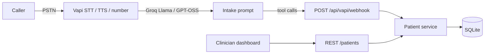

# Northwind Family Clinic — Voice intake

A live US phone line answers as Avery, a conversational intake coordinator. The agent collects patient demographics, confirms them, and writes the chart through the same service layer as the REST API. A clinician dashboard shows patients, mock first appointments, and call transcripts.

This is a take-home assessment system. It is **not HIPAA-compliant**. Do not store real patient data.

## Live demo

| | |
|---|---|
| **Dial** | **+1 (531) 213-1028** |
| **Public dashboard / API** | https://architectural-absorption-duck-nearly.trycloudflare.com |
| **Local desk** | `http://127.0.0.1:43145` after the steps below |

The phone number is a Vapi free US line. Voice tool calls only persist if `PUBLIC_API_URL` still reaches this app. Assistant ids live in `data/live.json`.

The desk opens on **Today** — roster counts, upcoming visits, latest calls — with Patients, Schedule, and Calls as full boards. Synthetic demo data only.

## Run on your machine

Node **22+**. `better-sqlite3` needs a working C++ toolchain (Xcode CLT on macOS, `build-essential` on Debian/Ubuntu).

### 1. Get the code

```bash
git clone https://github.com/CSshabbar/northwind-intake.git
cd northwind-intake
```

### 2. Env file (names only — never commit values)

```bash
cp .env.example .env.local
```

Put these in `.env.local`:

| Name | Required for | What to paste |
|---|---|---|
| `VAPI_API_KEY` | Desk **Call Avery**, phone tools | Vapi **private** key (dashboard.vapi.ai → Organization → API Keys) |
| `GROQ_API_KEY` | `npm run provision` only | Groq key from console.groq.com |
| `VAPI_WEBHOOK_SECRET` | Voice webhooks | Any secret: `openssl rand -hex 32` |
| `PUBLIC_API_URL` | Voice that **saves** charts | Public HTTPS origin (tunnel). Leave empty for desk-only |
| `DATABASE_PATH` | Optional | Defaults to `data/clinic.sqlite` |
| `NEXT_PUBLIC_INTAKE_PHONE` | Optional | Fallback if `data/live.json` is missing |
| `VAPI_ASSISTANT_ID` | Optional | Fallback if `data/live.json` is missing |

Do not commit `.env.local`. Do not reuse a screenshot or chat log of keys.

### 3. Install, test, start

```bash
npm install
npm test
npm run dev
```

Production-style:

```bash
npm run build
npm start
```

Open **http://127.0.0.1:43145** (binds `0.0.0.0:43145`). First boot creates SQLite and seeds Jane Doe and Carlos Mendez.

### 4. Verify

1. **Desk UI** — Today board loads (stats, recent patients, latest calls). Open **Patients** → Jane Doe chart. **Schedule** and **Calls** are full boards, not blank pages.
2. **API** — `curl http://127.0.0.1:43145/patients` returns `{ "data": [ ... ], "error": null }`. `curl http://127.0.0.1:43145/api/health` should be 200.
3. **Call path (no tunnel)** — **Call Avery** → `/call` → allow mic. Same assistant as +1 (531) 213-1028. Charts will **not** save from the call until Vapi can reach a public webhook.
4. **Call path (saves charts)** — in a second terminal:

```bash
cloudflared tunnel --url http://127.0.0.1:43145
```

Copy the `https://*.trycloudflare.com` URL into `.env.local` as `PUBLIC_API_URL`, then:

```bash
set -a && source .env.local && set +a
export PUBLIC_API_URL=https://<assigned>.trycloudflare.com
npm run provision
```

That updates Avery’s webhook to your laptop. Then register a fake patient on `/call` or the phone line; refresh Patients and confirm the new chart.

`npm run provision` is idempotent: Groq credential, Avery assistant, free Vapi US number, writes `data/live.json`.

Never commit `.env.local`. Names and when you need each variable are in **Run on your machine** above.

## Architecture



- **Telephony / STT / TTS:** Vapi free US number. Conversation design lives in `prompts/intake-coordinator.md`.
- **LLM:** Groq, brought as a Vapi credential so we are not billed for Vapi-hosted OpenAI.
- **App:** Next.js App Router — one Node process for REST, webhooks, and the dashboard.
- **Persistence:** SQLite with WAL. Survives process restart on local disk. Seeded charts plus appointments and a sample transcript.
- **Voice writes:** Avery's tools call `createPatient` / `updatePatient` / `scheduleFirstAppointment` / `upsertCallRecord` — the same functions as the HTTP handlers.

## REST API

Envelope: `{ "data": ..., "error": null }` or `{ "data": null, "error": { "message", "code", "details?" } }`.

| Method | Path | Notes |
|---|---|---|
| GET | `/patients` | Filters: `last_name`, `date_of_birth`, `phone_number` |
| POST | `/patients` | 201 + created chart. 422 on validation or duplicate phone |
| GET | `/patients/:id` | 404 if missing or soft-deleted |
| PUT | `/patients/:id` | Partial updates |
| DELETE | `/patients/:id` | Sets `deleted_at`; does not hard-delete |
| GET | `/patients/:id/appointments` | Mock visits |
| GET | `/patients/:id/calls` | Transcript + summary |
| GET | `/api/health` | Live number and public URL |
| GET | `/api/vapi/web-call` | Public Vapi key + assistant id for the in-browser call |
| POST | `/api/vapi/web-call` | Starts a Vapi web call using the org public key |

Validation is server-side (Zod): names, US phone, DOB not in the future, sex enum, state abbreviation, ZIP / ZIP+4, optional email and insurance.

Collected payloads are logged to stdout as `[intake] created patient` / `updated patient` / `tool-call` / `end-of-call-report`.

## Voice agent

Avery is a warm front-desk coordinator, not an IVR. The prompt in `prompts/intake-coordinator.md` covers:

- One short question at a time; she waits, and never fills in the caller’s answer
- Required fields first; optional insurance / emergency / language only if the caller opts in
- Read-back confirmation before `save_patient` that sounds like a sticky note, not an affidavit
- Gentle re-prompts on invalid phone, DOB, ZIP, state — never “please provide”
- Duplicate phone → offer to update
- Write failures → apologize and retry, never fake success
- Spanish if the caller asks (`Hablo español`)
- Mock first appointment after save, without pushing
- End-of-call report stored and linked to the patient when the phone matches

## Stack justification

Vapi is the fastest way to a real US number with barge-in and tool calling. Groq keeps LLM latency low and cost on the free tier. Next.js lets the API, webhook, and dashboard share one service layer without a second backend. SQLite is enough for a single-instance assessment and needs no hosted database bill. shadcn/ui is the only component library.

## Trade-offs

- Cloudflare quick tunnels rotate on restart; re-run provision if the public URL changes.
- SQLite is local to this VM, not multi-region.
- Appointments are mock slots, not a real EHR calendar.
- Groq free-tier rate limits can stall a call; the webhook still fails loudly rather than silently “saving.”
- Not HIPAA. Synthetic data only.
- Vapi starter call credit is finite.

## Tests

```bash
npm test
```

Coverage: validation, duplicate phone, filters, soft delete, appointment helper, and HTTP envelope/status codes for the `/patients` handlers.

## Next steps

- Pin a named tunnel or Fly.io hostname so the webhook URL is stable.
- Move SQLite to Postgres if more than one instance is needed.
- Add dashboard auth and audit log.
- Replace mock scheduling with a real clinic calendar.
- If this were production: BAA, encryption, minimum necessary access — none of which this assessment claims.

## Prompt

The Groq system message is documented in [`prompts/intake-coordinator.md`](prompts/intake-coordinator.md) and loaded verbatim by `scripts/provision-vapi.mjs`.
